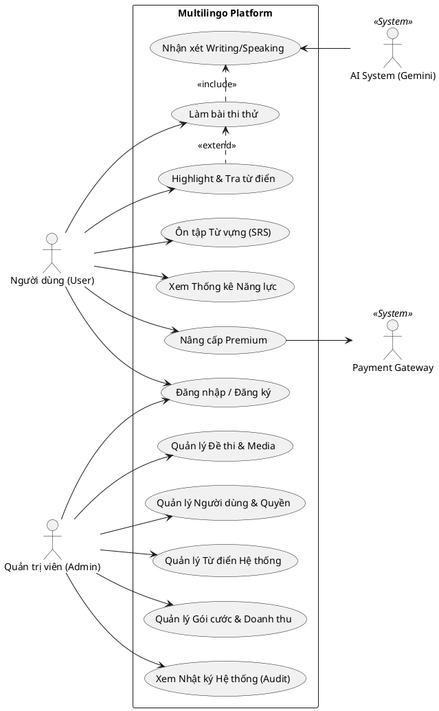

# HƯỚNG DẪN XÂY DỰNG USE CASE TỔNG QUÁT
*Dự án: Nền tảng Thi thử và Đánh giá năng lực Đa ngôn ngữ (Multilingo)*

Tài liệu này hướng dẫn bạn cách vẽ và định nghĩa Use Case Diagram (Biểu đồ ca sử dụng) tổng quát nhất cho dự án, dựa trên các chức năng đã được thống nhất. Bạn có thể sử dụng nội dung này để đưa thẳng vào Báo cáo thực tập / Đồ án môn học.

---

## 1. Xác định các Tác nhân (Actors)
Hệ thống của chúng ta có 3 tác nhân chính tương tác với hệ thống:

1. **Người dùng (User / Student):** Người có nhu cầu ôn luyện, làm bài thi, và học từ vựng.
2. **Quản trị viên (Admin):** Người điều hành nền tảng, tạo đề thi, quản lý người dùng và doanh thu.
3. **Hệ thống AI (AI System - System Actor):** Tác nhân phụ trợ từ bên ngoài (Gemini API) tự động chấm điểm và sinh ngữ cảnh từ vựng.
4. **Cổng thanh toán (Payment Gateway - System Actor):** Tác nhân phụ trợ (VNPAY/MOMO) xử lý giao dịch.

---

## 2. Xác định các Use Case (Ca sử dụng) chính

### Nhóm Use Case của Người dùng (User)
1. **UC01: Quản lý Tài khoản** (Bao gồm Đăng nhập, Đăng ký, Quản lý hồ sơ).
2. **UC02: Làm bài thi thử** (Mock Test / Practice).
   - *Include:* Xem kết quả bài làm.
   - *Include:* Gọi AI chấm điểm Writing/Speaking.
3. **UC03: Quản lý Sổ tay Từ vựng & Công cụ Hỗ trợ**
   - *Extend:* Highlight & Tra từ điển tại chỗ (Khi bôi đen văn bản trong bài đọc).
   - *Include:* Ôn tập ngắt quãng (SRS).
4. **UC04: Xem Thống kê Năng lực** (Radar Chart).
5. **UC05: Mua Gói cước (Premium)**
   - *Include:* Thanh toán qua cổng VNPAY/MOMO.

### Nhóm Use Case của Quản trị viên (Admin)
6. **UC06: Quản lý Đề thi** (Thêm, Sửa, Xóa, Ẩn/Hiện đề thi và Upload file Audio/Image).
7. **UC07: Quản lý Người dùng & Phân quyền** (Block user, Phân quyền Role/Permission).
8. **UC08: Quản lý Từ điển Hệ thống** (Thêm, Sửa từ vựng mặc định).
9. **UC09: Quản lý Doanh thu & Gói cước** (Tạo gói Premium, Xem giao dịch).
10. **UC10: Quản trị Hệ thống** (Xem Audit Log, Gửi Notification).

---

## 3. Code PlantUML (Dùng để vẽ Biểu đồ tự động)
Nếu bạn không muốn vẽ tay, hãy copy đoạn code dưới đây, dán vào trang web **[PlantUML Web Server](http://www.plantuml.com/plantuml/uml/)** hoặc Extension của VS Code. Nó sẽ tự động vẽ ra biểu đồ Use Case cực đẹp cho bạn!

---

## 4. Cách viết Đặc tả Use Case (Ví dụ mẫu)
Trong đồ án, giảng viên thường yêu cầu viết "Đặc tả Use Case" (Use Case Specification). Bạn có thể làm theo bảng mẫu chuẩn sau cho từng chức năng:

**Ví dụ Đặc tả cho: UC02 - Làm bài thi thử**
- **Tên Use Case:** Làm bài thi thử (Mock Test).
- **Actor (Tác nhân):** Người dùng (User).
- **Mô tả:** Cho phép người dùng làm bài thi đánh giá năng lực trong một thời gian quy định.
- **Tiền điều kiện (Pre-conditions):** Người dùng đã đăng nhập vào hệ thống.
- **Luồng sự kiện chính (Main Flow):**
  1. User truy cập thư viện Đề thi.
  2. Hệ thống hiển thị danh sách các đề thi khả dụng.
  3. User chọn một đề thi và bấm "Bắt đầu".
  4. Hệ thống tải dữ liệu (Audio, Câu hỏi) và bắt đầu đếm ngược thời gian.
  5. User điền đáp án.
  6. User bấm "Nộp bài".
  7. Hệ thống tự động chấm điểm các phần trắc nghiệm và gọi AI chấm phần tự luận.
  8. Hệ thống lưu kết quả vào Database và hiển thị điểm số.
- **Luồng thay thế (Alternate Flow):** 
  - (Luồng 4a) Hết giờ mà User chưa nộp bài -> Hệ thống tự động thu bài và chấm điểm những câu đã làm.
- **Hậu điều kiện (Post-conditions):** Kết quả bài làm được lưu lại vào lịch sử thi của User.
