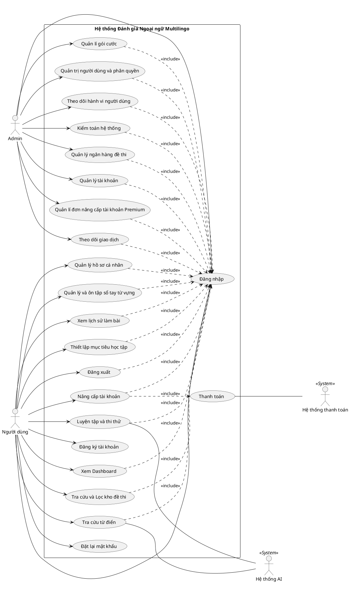

# HƯỚNG DẪN XÂY DỰNG USE CASE TỔNG QUÁT
*Dự án: Hệ thống Nền tảng Thi thử và Đánh giá Ngoại ngữ Multilingo*

Tài liệu này hướng dẫn bạn cách vẽ và định nghĩa Use Case Diagram (Biểu đồ ca sử dụng) tổng quát nhất cho dự án, dựa sát 100% vào sơ đồ Use Case mà bạn vừa cung cấp.

---

## 1. Xác định các Tác nhân (Actors)
Hệ thống của chúng ta có 4 tác nhân chính tương tác:

1. **Người dùng (User):** Học viên có nhu cầu ôn luyện, làm bài thi, và tra cứu từ vựng.
2. **Quản trị viên (Admin):** Người điều hành nền tảng, quản lý đề thi, doanh thu và kiểm soát tài khoản.
3. **Hệ thống AI (System Actor):** Tác nhân phụ trợ hỗ trợ chấm điểm bài thi (Writing/Speaking) và dịch từ vựng theo ngữ cảnh.
4. **Hệ thống thanh toán (System Actor):** Tác nhân phụ trợ (VNPAY/MOMO) xử lý giao dịch.

---

## 2. Xác định các Use Case (Ca sử dụng) chính

Dựa vào sơ đồ Use Case của bạn, các chức năng được gom lại như sau:

### Nhóm Use Case của Người dùng (User)
*Lưu ý: Hầu hết các Use Case này đều mang mối quan hệ `<<include>>` đến **Đăng nhập**.*
- **Đăng nhập** (UC Trung tâm)
- **Đăng ký tài khoản** (Không cần đăng nhập)
- **Đặt lại mật khẩu** (Không cần đăng nhập)
- **Đăng xuất**
- **Xem Dashboard**
- **Thiết lập mục tiêu học tập**
- **Quản lý hồ sơ cá nhân**
- **Tra cứu và Lọc kho đề thi**
- **Luyện tập và thi thử:** Có sự tương tác của `Hệ thống AI`.
- **Tra cứu từ điển:** Có sự tương tác của `Hệ thống AI`.
- **Quản lý và ôn tập sổ tay từ vựng**
- **Xem lịch sử làm bài**
- **Nâng cấp tài khoản:** Chức năng này `<<include>>` một Use Case là **Thanh toán**, và được xử lý bởi `Hệ thống thanh toán`.

### Nhóm Use Case của Quản trị viên (Admin)
*(Các Use Case này đều `<<include>>` Đăng nhập)*
- **Quản lý tài khoản:** Thay đổi thông tin hồ sơ Admin.
- **Quản trị người dùng và phân quyền:** Cấp quyền (Role), mở/khóa tài khoản.
- **Theo dõi hành vi người dùng (Tracking):** Xem Last Login, theo dõi tiến trình học tập, địa chỉ IP.
- **Kiểm toán hệ thống (Audit Logs):** Xem nhật ký hệ thống, thống kê người dùng (DAU/MAU) và phát hiện gian lận.
- **Quản lý ngân hàng đề thi:** Thêm/sửa/xóa cấu trúc đề, upload media.
- **Quản lí gói cước:** Cấu hình và tạo ra các gói Premium mới.
- **Quản lí đơn nâng cấp tài khoản Premium**
- **Theo dõi giao dịch:** Xem hóa đơn thanh toán của người dùng.

---

## 3. Code PlantUML (Dùng để vẽ Biểu đồ tự động)
Bạn chỉ cần copy đoạn code PlantUML dưới đây, dán vào **[PlantUML Web Server](http://www.plantuml.com/plantuml/uml/)**. Nó sẽ tự động sinh ra một biểu đồ Use Case giống y hệt hình vẽ gốc của bạn nhưng vô cùng rõ nét và chuyên nghiệp!

---

## 4. Cách viết Đặc tả Use Case (Ví dụ mẫu cho Báo cáo)
Để báo cáo chi tiết, bạn có thể tham khảo mẫu Đặc tả Use Case sau:

**Ví dụ Đặc tả cho Use Case: Luyện tập và thi thử**
- **Tên Use Case:** Luyện tập và thi thử.
- **Tác nhân (Actor):** Người dùng, Hệ thống AI.
- **Mô tả:** Cho phép người dùng làm bài thi thử đánh giá năng lực hoặc luyện tập từng phần kỹ năng riêng biệt.
- **Tiền điều kiện:** Người dùng đã đăng nhập hệ thống thành công.
- **Luồng sự kiện chính:**
  1. Người dùng truy cập kho đề thi và chọn một bài thi.
  2. Hệ thống tải dữ liệu (Âm thanh, Văn bản, Câu hỏi) và mở giao diện thi.
  3. Người dùng đọc văn bản, nghe Audio và chọn đáp án.
  4. Người dùng bôi đen từ khó để tra từ điển ngay tại chỗ (Giao tiếp với `Hệ thống AI`).
  5. Người dùng bấm "Nộp bài".
  6. Hệ thống chấm điểm trắc nghiệm tức thì. Với phần Tự luận (Writing/Speaking), hệ thống gửi sang `Hệ thống AI` để nhận xét và cho điểm.
  7. Hệ thống hiển thị biểu đồ phân tích và lưu lịch sử làm bài.
- **Luồng thay thế:** 
  - (Chế độ thi thật) Hết giờ đếm ngược mà người dùng chưa nộp -> Hệ thống tự động thu bài và chấm điểm câu đã làm.
- **Hậu điều kiện:** Kết quả được lưu vào cơ sở dữ liệu. Điểm số được sử dụng để vẽ Biểu đồ năng lực cho Người dùng.
