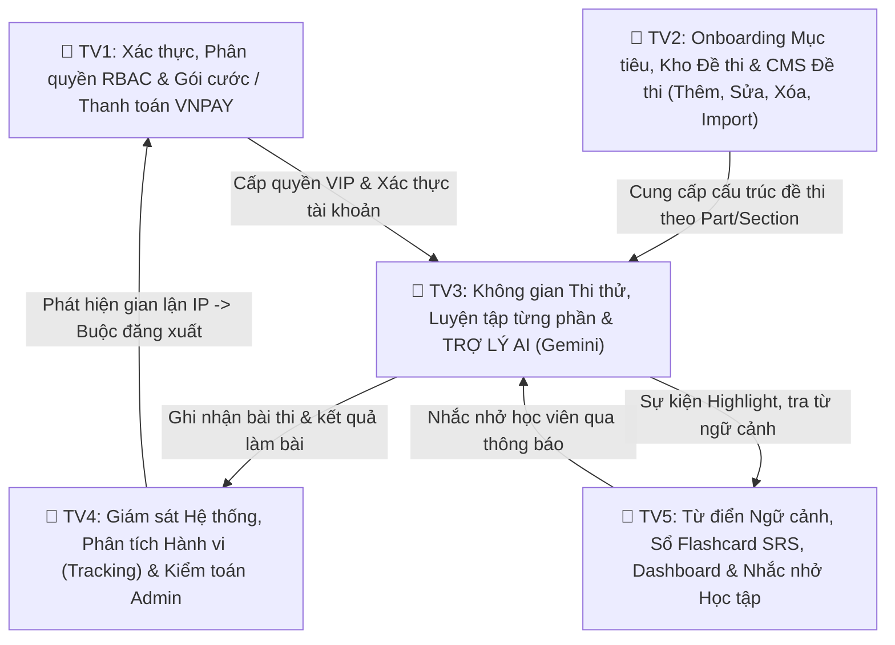
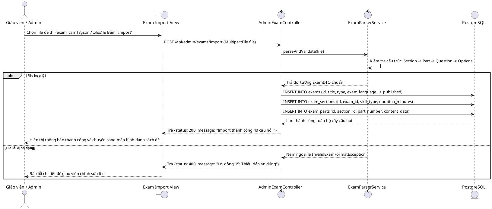
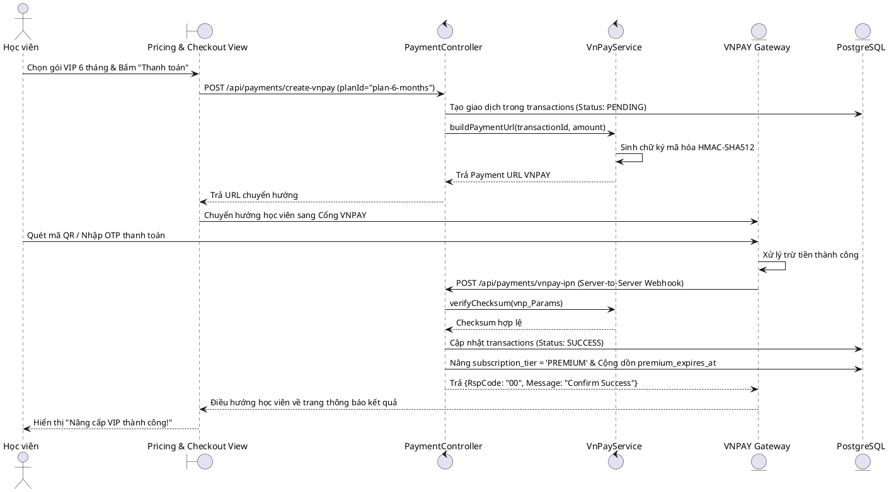
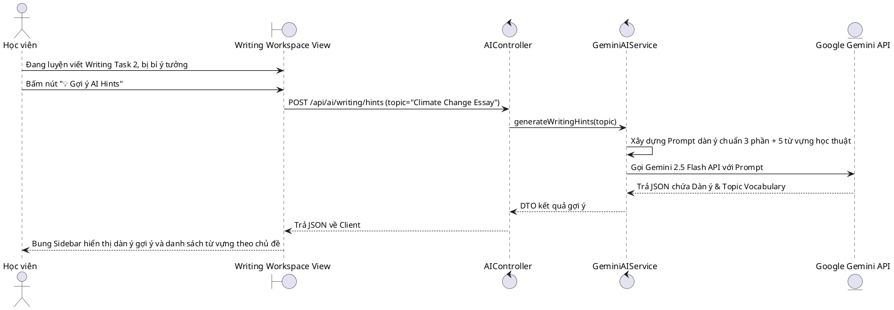
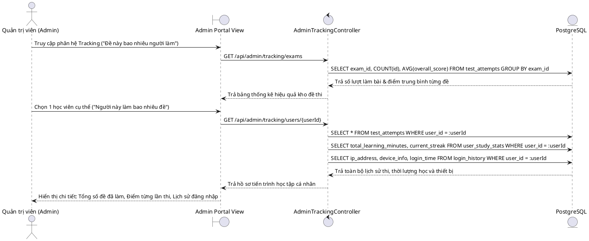
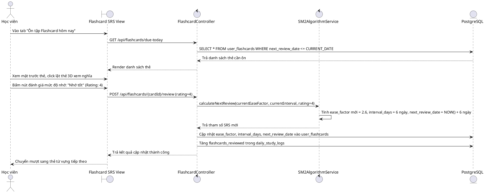

# BẢNG PHÂN CÔNG NHIỆM VỤ CHI TIẾT NHÓM 5 NGƯỜI
## (QUY ĐỊNH CHUẨN HÓA 100% BIỂU ĐỒ HOẠT ĐỘNG & TUẦN TỰ THEO ĐÚNG DANH MỤC USE CASE)

**Dự án:** Nền tảng Thi thử và Đánh giá Ngoại ngữ Multilingo (Multilingo Platform)  
**Tài liệu tham chiếu:** [docs/md](file:///f:/Working/JavaBackend/multilingo-platform/docs/md) ([HUONG_DAN_USE_CASE.md](file:///f:/Working/JavaBackend/multilingo-platform/docs/md/HUONG_DAN_USE_CASE.md), [PHAN_RA_CHUC_NANG.md](file:///f:/Working/JavaBackend/multilingo-platform/docs/md/PHAN_RA_CHUC_NANG.md), [CHUC_NANG_HE_THONG.md](file:///f:/Working/JavaBackend/multilingo-platform/docs/md/CHUC_NANG_HE_THONG.md), [CHI_TIET_CHUC_NANG.md](file:///f:/Working/JavaBackend/multilingo-platform/docs/md/CHI_TIET_CHUC_NANG.md), [LUONG_THUC_HIEN.md](file:///f:/Working/JavaBackend/multilingo-platform/docs/md/LUONG_THUC_HIEN.md), [DATABASE_SCHEMA.md](file:///f:/Working/JavaBackend/multilingo-platform/docs/md/DATABASE_SCHEMA.md)) và [SRS_USE_CASE_SPECIFICATION.md](file:///f:/Working/JavaBackend/multilingo-platform/development/srs/SRS_USE_CASE_SPECIFICATION.md)

---

## 1. NGUYÊN TẮC THIẾT KẾ BIỂU ĐỒ (CHUẨN HÓA 1:1 VỚI SƠ ĐỒ USE CASE)

Theo đúng bản chất phân tích thiết kế hệ thống và tinh gọn biểu đồ báo cáo:
1. **Chỉ vẽ biểu đồ cho các Use Case thực sự độc lập:**
   * Mỗi Ca sử dụng chính (**UCxx**) và từng Nhánh mở rộng (**<<extend>> UCxx.y**) có đúng **1 Biểu đồ Hoạt động (Activity Diagram - AD)** và **1 Biểu đồ Tuần tự (Sequence Diagram - SD)**.
   * **BỎ HẲN `UC05.1` (Placement Test):** Tránh trùng lặp với luồng làm bài thi trắc nghiệm của `UC08`.
   * **TINH GỌN `UC14` (CMS Đề thi):** 
     - Tập trung vào đúng 4 nghiệp vụ Use Case cốt lõi: **Thêm mới (`UC14.1`)**, **Chỉnh sửa (`UC14.2`)**, **Xóa (`UC14.3`)** và **Import đề thi từ file (`UC14.4`)**.
     - **Bỏ các Use Case con riêng lẻ về Upload Audio, Upload Ảnh, và Toggle Xuất bản:** Vì thực tế đây chỉ là các trường nhập liệu (field/action) nằm bên trong form Thêm/Sửa đề thi, không phải là các Use Case độc lập cần vẽ riêng AD/SD.
   * **Không vẽ các biểu đồ kỹ thuật nội bộ tự phát** (như cron job, webhook riêng, view con). Luồng thanh toán VNPAY được gộp trọn vẹn trong `UC06`.
2. **Phân công nghiệp vụ:**
   * **Thành viên 2:** Phụ trách toàn diện **`UC05` (Onboarding mục tiêu)** + **`UC07/07.1` (Kho đề thi & Gợi ý đề)** + **`UC14.1` $\rightarrow$ `UC14.4` (Trọn bộ CMS Đề thi: Thêm, Sửa, Xóa, Import)**.
   * **Thành viên 5:** Tập trung 100% vào chu trình Học tập cá nhân hóa: Từ điển ngữ cảnh, Sổ Flashcard SRS, Dashboard năng lực và Nhắc nhở học tập (`UC12.3`).

---

## 2. BẢNG MA TRẬN PHÂN CÔNG TỔNG QUAN 5 THÀNH VIÊN

### Bảng thống kê định lượng biểu đồ chuẩn hóa:

| Thành viên | Phân hệ & Trách nhiệm cốt lõi | Danh mục Use Case & Extend chuẩn hóa (1:1) | Số lượng AD | Số lượng SD |
| :---: | :--- | :--- | :---: | :---: |
| **TV 1** | **Xác thực, Phân quyền RBAC & Thanh toán VNPAY** | `UC01`, `UC01.1`, `UC02`, `UC03`, `UC04`, `UC04.1`, `UC04.2`, `UC06`, `UC15.2/16.1` | **9 Biểu đồ** | **9 Biểu đồ** |
| **TV 2** | **Onboarding Mục tiêu, Kho Đề thi & CMS Đề thi (CRUD + Import)** | `UC05`, `UC07`, `UC07.1`, `UC14.1` $\rightarrow$ `UC14.4` *(Thêm, Sửa, Xóa, Import đề)* | **7 Biểu đồ** | **7 Biểu đồ** |
| **TV 3** | **Không gian Thi thử, Luyện tập & TRỢ LÝ AI (Gemini)** | `UC08`, `UC08.1`, `UC08.4`, `UC08.5`, `UC09`, `UC09.2`, `UC10`, `UC10.2` | **8 Biểu đồ** | **8 Biểu đồ** |
| **TV 4** | **Giám sát Hệ thống, Tracking Hành vi & Kiểm toán** | `A_Tracking`, `UC15`, `UC15.1`, `UC15.3`, `UC15.4`, `UC16`, `UC16.2`, `UC16.3` | **8 Biểu đồ** | **8 Biểu đồ** |
| **TV 5** | **Từ điển Ngữ cảnh, Sổ Flashcard SRS & Dashboard** | `UC08.2`, `UC08.3`, `UC11`, `UC12`, `UC12.1`, `UC12.2`, `UC12.3`, `UC13`, `UC13.1/13.2` | **9 Biểu đồ** | **9 Biểu đồ** |
| **TỔNG** | **TOÀN BỘ DỰ ÁN MULTILINGO PLATFORM** | **CHUẨN 100% CÁC NGHIỆP VỤ THỰC TẾ** | **41 Biểu đồ AD** | **41 Biểu đồ SD** |

---

## 3. DANH MỤC BIỂU ĐỒ CHI TIẾT CỦA TỪNG THÀNH VIÊN

---

### 👤 THÀNH VIÊN 1: Xác thực, Phân quyền RBAC & Gói cước / Thanh toán VNPAY

#### 1. Cơ sở dữ liệu sở hữu ([DATABASE_SCHEMA.md](file:///f:/Working/JavaBackend/multilingo-platform/docs/md/DATABASE_SCHEMA.md))
* `users`, `roles`, `permissions`, `role_permissions`, `refresh_tokens`, `subscription_plans`, `transactions`.

#### 2. Danh mục Biểu đồ Hoạt động (Activity Diagrams) cần vẽ (9 Biểu đồ)
1. **AD-UC01 (UC01 - Đăng nhập hệ thống):** Nhập thông tin hoặc chọn Google OAuth2 $\rightarrow$ Xác thực danh tính $\rightarrow$ Cấp cặp JWT Tokens (Access & Refresh Token) $\rightarrow$ Lưu lịch sử phiên đăng nhập.
2. **AD-UC01.1 (UC01.1 - Đặt lại mật khẩu):** Yêu cầu quên mật khẩu $\rightarrow$ Nhập Email $\rightarrow$ Nhận link xác thực qua Email $\rightarrow$ Nhập mật khẩu mới $\rightarrow$ Mã hóa Bcrypt và cập nhật DB.
3. **AD-UC02 (UC02 - Đăng xuất):** Người dùng yêu cầu đăng xuất $\rightarrow$ Hủy phiên làm việc trên Client $\rightarrow$ Thu hồi Refresh Token trên Redis/DB (`is_revoked = true`).
4. **AD-UC03 (UC03 - Đăng ký tài khoản):** Nhập form đăng ký $\rightarrow$ Validate $\rightarrow$ Kiểm tra trùng Email $\rightarrow$ Mã hóa mật khẩu $\rightarrow$ Tạo tài khoản gán `ROLE_STUDENT` hạng `FREE`.
5. **AD-UC04 (UC04 - Quản lý hồ sơ cá nhân):** Xem thông tin hồ sơ, ngày tham gia, gói cước hiện tại.
6. **AD-UC04.1 (UC04.1 - Đổi mật khẩu tài khoản):** Xác thực mật khẩu cũ $\rightarrow$ Kiểm tra độ mạnh mật khẩu mới $\rightarrow$ Lưu mật khẩu mã hóa mới.
7. **AD-UC04.2 (UC04.2 - Cập nhật ảnh đại diện & thông tin):** Tải ảnh avatar mới $\rightarrow$ Upload lưu trữ $\rightarrow$ Cập nhật thông tin cá nhân.
8. **AD-UC06 (UC06 - Mua và thanh toán gói cước VIP):** Chọn gói VIP $\rightarrow$ Khởi tạo giao dịch VNPAY $\rightarrow$ Chuyển hướng sang cổng VNPAY quét mã/nhập thẻ $\rightarrow$ Xác thực IPN Webhook $\rightarrow$ Nâng hạng `PREMIUM` và cộng ngày hết hạn.
9. **AD-UC15.2 (UC15.2 & UC16.1 - Quản trị RBAC & Bảng giá VIP):** Admin gán Role/Permission cho người dùng và điều chỉnh bảng giá gói cước `subscription_plans`.

#### 3. Danh mục Biểu đồ Tuần tự (Sequence Diagrams) cần vẽ (9 Biểu đồ)
1. **SD-UC01 (UC01 - Đăng nhập Email & Google OAuth2):** `User` $\rightarrow$ `LoginView` $\rightarrow$ `AuthController` $\rightarrow$ `SecurityService` / `GoogleServer` $\rightarrow$ `UserRepository` $\rightarrow$ `JwtTokenProvider` $\rightarrow$ `Redis` $\rightarrow$ Trả Tokens.
2. **SD-UC01.1 (UC01.1 - Đặt lại mật khẩu qua Email):** `User` $\rightarrow$ `ForgotPasswordView` $\rightarrow$ `AuthController` $\rightarrow$ `MailService` $\rightarrow$ Verify Token $\rightarrow$ Update Password trong `UserRepository`.
3. **SD-UC02 (UC02 - Đăng xuất hệ thống):** `User` $\rightarrow$ `HeaderView` $\rightarrow$ `AuthController` $\rightarrow$ `Redis` (Blacklist Token) $\rightarrow$ `RefreshTokenRepository` (`is_revoked = true`).
4. **SD-UC03 (UC03 - Đăng ký tài khoản mới):** `User` $\rightarrow$ `RegisterView` $\rightarrow$ `AuthController` $\rightarrow$ `UserRepository.existsByEmail()` $\rightarrow$ `PasswordEncoder` $\rightarrow$ Lưu `users` $\rightarrow$ Trả kết quả.
5. **SD-UC04 (UC04 - Xem hồ sơ cá nhân):** `User` $\rightarrow$ `ProfileView` $\rightarrow$ `UserController` $\rightarrow$ `UserRepository.findById()` $\rightarrow$ Trả DTO hồ sơ.
6. **SD-UC04.1 (UC04.1 - Đổi mật khẩu):** `User` $\rightarrow$ `ProfileView` $\rightarrow$ `UserController` $\rightarrow$ `PasswordEncoder.matches()` $\rightarrow$ Encode mật khẩu mới $\rightarrow$ Cập nhật DB.
7. **SD-UC04.2 (UC04.2 - Cập nhật Avatar & Thông tin):** `User` $\rightarrow$ `ProfileView` $\rightarrow$ `UserController` $\rightarrow$ `MediaService` (Upload Avatar) $\rightarrow$ Cập nhật `UserRepository`.
8. **SD-UC06 (UC06 - Mua gói VIP & Thanh toán VNPAY):** `User` $\rightarrow$ `PricingView` $\rightarrow$ `PaymentController` $\rightarrow$ Tạo `transactions` (PENDING) $\rightarrow$ Sinh URL VNPAY (HMAC-SHA512) $\rightarrow$ Chuyển hướng VNPAY $\rightarrow$ `VNPAY` gửi Webhook IPN $\rightarrow$ Verify Checksum $\rightarrow$ Set `transactions = SUCCESS` $\rightarrow$ Nâng `subscription_tier = PREMIUM` $\rightarrow$ Cập nhật `premium_expires_at`.
9. **SD-UC15.2 (UC15.2 & UC16.1 - Quản lý Phân quyền RBAC & Giá gói):** `Admin` $\rightarrow$ `AdminPortal` $\rightarrow$ `AdminUserController` $\rightarrow$ Gán Role vào `role_permissions` & Cập nhật giá gói trong `subscription_plans`.

---

### 👤 THÀNH VIÊN 2: Onboarding Mục tiêu, Kho Đề thi & CMS Đề thi Đa cấp (CRUD + Import)
*(Đã tinh gọn: Bỏ các UC con Audio, Ảnh, Xuất bản để gộp vào Thêm/Sửa đề thi)*

#### 1. Cơ sở dữ liệu sở hữu ([DATABASE_SCHEMA.md](file:///f:/Working/JavaBackend/multilingo-platform/docs/md/DATABASE_SCHEMA.md))
* `exams`: Mã đề (`cam-18-test-1`), tiêu đề, loại chứng chỉ, ngôn ngữ, cờ xuất bản `is_published`.
* `exam_sections`: Các kỹ năng (READING, LISTENING, WRITING), thời lượng từng phần.
* `exam_parts`: Chứa cột **`content_data` (JSONB)** lưu bài đọc, audio URL, câu hỏi, đáp án đúng và lời giải thích.
* `users` *(các trường Onboarding: `native_language`, `target_language`, mục tiêu điểm số)*.

#### 2. Danh mục Biểu đồ Hoạt động (Activity Diagrams) cần vẽ (7 Biểu đồ)
1. **AD-UC05 (UC05 - Thiết lập mục tiêu học tập Onboarding):** Học viên đăng nhập lần đầu $\rightarrow$ Chọn ngôn ngữ mẹ đẻ, ngôn ngữ muốn học $\rightarrow$ Chọn chứng chỉ mục tiêu (IELTS/TOEIC/VNLTV) và điểm kỳ vọng (Target Band) $\rightarrow$ Lưu vào hồ sơ $\rightarrow$ Chuyển thẳng vào Kho đề thi.
2. **AD-UC07 (UC07 - Tra cứu & Lọc kho đề thi):** Học viên vào thư viện đề thi $\rightarrow$ Chọn tiêu chí lọc (Chứng chỉ, kỹ năng, Free/VIP, độ khó) $\rightarrow$ Hệ thống lọc và hiển thị danh mục đề thi tương ứng.
3. **AD-UC07.1 (UC07.1 - Gợi ý đề thi theo mục tiêu cá nhân):** Hệ thống đọc Target Band từ kết quả Onboarding của học viên $\rightarrow$ Tự động đề xuất danh sách các bộ đề phù hợp với năng lực.
4. **AD-UC14.1 (UC14.1 - Thêm mới đề thi đa cấp):** Giáo viên/Admin tạo đề thi mới (Exam) $\rightarrow$ Nhập thông tin $\rightarrow$ Tạo Section $\rightarrow$ Tạo Part $\rightarrow$ Tải lên Audio/Ảnh minh họa $\rightarrow$ Soạn câu hỏi/đáp án/giải thích $\rightarrow$ Đóng gói lưu cấu trúc JSONB.
5. **AD-UC14.2 (UC14.2 - Chỉnh sửa đề thi):** Giáo viên/Admin chọn đề $\rightarrow$ Load cây câu hỏi hiện tại $\rightarrow$ Sửa nội dung bài đọc, cập nhật media, sửa đáp án, đổi trạng thái xuất bản (`is_published`) $\rightarrow$ Cập nhật vào DB.
6. **AD-UC14.3 (UC14.3 - Xóa đề thi):** Giáo viên/Admin chọn đề cần xóa $\rightarrow$ Xác nhận xóa $\rightarrow$ Kiểm tra ràng buộc (đã có lượt thi chưa) $\rightarrow$ Xóa đề thi (hoặc xóa mềm) và đồng bộ lưu vết sang Nhật ký kiểm toán `audit_logs`.
7. **AD-UC14.4 (UC14.4 - Import đề thi từ file):** Giáo viên/Admin tải lên tệp dữ liệu đề thi (File JSON cấu trúc chuẩn hoặc File Excel câu hỏi) $\rightarrow$ Hệ thống parse cấu trúc file $\rightarrow$ Validate tính toàn vẹn (đủ số câu, đáp án đúng) $\rightarrow$ Tự động sinh Exam, Sections, Parts lưu hàng loạt vào DB.

#### 3. Danh mục Biểu đồ Tuần tự (Sequence Diagrams) cần vẽ (7 Biểu đồ)
1. **SD-UC05 (UC05 - Lưu mục tiêu Onboarding):** `Student` $\rightarrow$ `OnboardingView` $\rightarrow$ `UserController.saveTarget()` $\rightarrow$ Cập nhật `native_language`, `target_language` vào `users` $\rightarrow$ Khởi tạo `user_study_stats` $\rightarrow$ Chuyển hướng sang Thư viện đề thi.
2. **SD-UC07 (UC07 - Tra cứu và Lọc kho đề thi):** `Student` $\rightarrow$ `ExamCatalogView` $\rightarrow$ `ExamController.filterExams()` $\rightarrow$ `ExamRepository.findAllWithFilter()` $\rightarrow$ Trả danh sách đề thi kèm phân trang.
3. **SD-UC07.1 (UC07.1 - Gợi ý đề thi theo mục tiêu):** `Student` $\rightarrow$ `ExamCatalogView` $\rightarrow$ `ExamController.getRecommendedExams()` $\rightarrow$ Lấy Target Band $\rightarrow$ Truy vấn đề thi tương ứng $\rightarrow$ Trả danh sách gợi ý.
4. **SD-UC14.1 (UC14.1 - Thêm mới đề thi đa cấp):** `Teacher` $\rightarrow$ `ExamBuilderView` (Nhập Part, tải Audio/Ảnh lên Cloud) $\rightarrow$ `AdminExamController.createExam()` $\rightarrow$ Validate cây câu hỏi $\rightarrow$ Lưu `exams`, `exam_sections` $\rightarrow$ Đóng gói JSONB vào `exam_parts.content_data`.
5. **SD-UC14.2 (UC14.2 - Chỉnh sửa đề thi):** `Teacher` $\rightarrow$ `ExamEditView` $\rightarrow$ `AdminExamController.updateExam(examId)` $\rightarrow$ Cập nhật dữ liệu, media và cờ `is_published` vào `exams` & `exam_parts` $\rightarrow$ Trả thông báo thành công.
6. **SD-UC14.3 (UC14.3 - Xóa đề thi):** `Teacher` $\rightarrow$ `ExamListView` $\rightarrow$ `AdminExamController.deleteExam(examId)` $\rightarrow$ `ExamRepository.deleteById()` $\rightarrow$ Ghi log xóa vào `audit_logs` $\rightarrow$ Trả kết quả.
7. **SD-UC14.4 (UC14.4 - Import đề thi từ file JSON/Excel):** `Teacher` $\rightarrow$ `ExamImportView` $\rightarrow$ Tải file `.json` / `.xlsx` $\rightarrow$ `AdminExamController.importExam(file)` $\rightarrow$ `ExamParserService.parseAndValidate()` $\rightarrow$ Lưu tự động vào `exams`, `sections`, `parts` $\rightarrow$ Trả kết quả import thành công.

---

### 👤 THÀNH VIÊN 3: Không gian Thi thử, Luyện tập từng phần & TRỢ LÝ AI (Gemini)

#### 1. Cơ sở dữ liệu sở hữu ([DATABASE_SCHEMA.md](file:///f:/Working/JavaBackend/multilingo-platform/docs/md/DATABASE_SCHEMA.md))
* `test_attempts`: Quản lý phiên (`test_scope`: `FULL_EXAM`, `SINGLE_SKILL`, `SINGLE_PART`; `test_mode`: `MOCK_TEST`, `PRACTICE`), thời gian làm bài, điểm số.
* `attempt_answers`: Chứa `user_answers` (JSONB), `is_correct_flags` (JSONB), và **`ai_feedback` (JSONB - kết quả AI chấm/sửa câu)**.

#### 2. Danh mục Biểu đồ Hoạt động (Activity Diagrams) cần vẽ (8 Biểu đồ)
1. **AD-UC08 (UC08 - Làm bài thi thử & Luyện tập từng phần):** Học viên chọn đề $\rightarrow$ Chọn chế độ: *Thi thử tính giờ (Mock Test)* hoặc *Luyện tập từng phần (Practice)* $\rightarrow$ Làm bài, nghe Audio $\rightarrow$ Chấm đáp án ngay (nếu Luyện tập) hoặc nộp bài tổng kết (nếu Thi thử).
2. **AD-UC08.1 (UC08.1 - Highlight đoạn văn bài đọc):** Học viên bôi đen đoạn văn bản quan trọng trong bài đọc $\rightarrow$ Bấm nút Highlight $\rightarrow$ Đoạn văn đổi màu vàng trực quan trên giao diện.
3. **AD-UC08.4 (UC08.4 - Gợi ý dàn ý & Từ vựng từ AI - Writing Hints):** Trong lúc luyện viết Writing $\rightarrow$ Học viên bị bí ý tưởng $\rightarrow$ Bấm "💡 Gợi ý AI Hints" $\rightarrow$ Gửi đề bài lên Gemini API $\rightarrow$ Trả dàn ý gợi ý và 5-10 từ vựng theo chủ đề.
4. **AD-UC08.5 (UC08.5 - Tự động thu bài khi hết giờ):** Đồng hồ đếm ngược về `00:00` $\rightarrow$ Khóa toàn bộ thao tác nhập liệu $\rightarrow$ Thu thập câu trả lời đã làm $\rightarrow$ Tự động gửi request nộp bài.
5. **AD-UC09 (UC09, UC09.1 - Chấm điểm trắc nghiệm & điền từ tự động):** Nhận JSON bài nộp $\rightarrow$ Đối chiếu từng câu với `correct_answer` $\rightarrow$ Chuẩn hóa văn bản (`trim()`, lowercase) $\rightarrow$ Sinh mảng `is_correct_flags` $\rightarrow$ Tính điểm tổng.
6. **AD-UC09.2 (UC09.2 - Chấm điểm bài viết Writing bằng Gemini AI):** Nhận bài viết tự luận $\rightarrow$ Xây dựng Prompt phân tích 4 tiêu chí quốc tế $\rightarrow$ Gọi Gemini 2.5 Flash API $\rightarrow$ Trả điểm thành phần, nhận xét và câu viết lại mượt mà $\rightarrow$ Lưu `ai_feedback`.
7. **AD-UC10 (UC10, UC10.1 - Xem kết quả bài thi & Lời giải chi tiết):** Hiển thị bảng điểm tổng quan $\rightarrow$ Bung xem chi tiết từng câu Đúng/Sai (Xanh/Đỏ) $\rightarrow$ Đọc lời giải thích chi tiết và bản dịch từng câu.
8. **AD-UC10.2 (UC10.2 - Xem nhận xét AI & Giao diện Diff-View sửa lỗi):** Mở tab Writing $\rightarrow$ Xem bảng điểm 4 tiêu chí $\rightarrow$ Xem giao diện so sánh sửa lỗi (Diff-View tô đỏ lỗi sai ngữ pháp, gạch chân xanh câu sửa đề xuất từ AI).

#### 3. Danh mục Biểu đồ Tuần tự (Sequence Diagrams) cần vẽ (8 Biểu đồ)
1. **SD-UC08 (UC08 - Thực hiện bài thi / Luyện tập):** `Student` $\rightarrow$ `ExamWorkspaceView` $\rightarrow$ `TestController.startTest()` $\rightarrow$ Tạo `test_attempts` (IN_PROGRESS) $\rightarrow$ Lấy dữ liệu đề từ `exam_parts` $\rightarrow$ Render giao diện làm bài.
2. **SD-UC08.1 (UC08.1 - Highlight văn bản bài đọc):** `Student` bôi đen văn bản $\rightarrow$ `ReadingPassageView` bắt sự kiện DOM $\rightarrow$ Gán thẻ `<mark>` và lưu tọa độ highlight vào LocalState.
3. **SD-UC08.4 (UC08.4 - Lấy AI Writing Hints):** `Student` $\rightarrow$ `WritingEditorView` $\rightarrow$ `AIController.getHints()` $\rightarrow$ `GeminiAIService` $\rightarrow$ Gemini API $\rightarrow$ Trả JSON dàn ý & từ vựng hiển thị lên Sidebar.
4. **SD-UC08.5 (UC08.5 - Tự động thu bài khi hết giờ):** `CountdownTimer` về 00:00 $\rightarrow$ `ExamView` kích hoạt submit $\rightarrow$ `TestController.submitTest()` $\rightarrow$ Chuyển trạng thái `COMPLETED`.
5. **SD-UC09 (UC09, UC09.1 - Chấm trắc nghiệm tự động):** `TestController` $\rightarrow$ `GradingEngine` $\rightarrow$ Lấy `correct_answer` $\rightarrow$ So khớp từng câu $\rightarrow$ Lưu mảng Đúng/Sai vào `attempt_answers.is_correct_flags`.
6. **SD-UC09.2 (UC09.2 - Chấm điểm Writing bằng Gemini AI):** `TestController` $\rightarrow$ `GeminiAIService.gradeWriting()` $\rightarrow$ Gửi bài viết và tiêu chí lên Gemini API $\rightarrow$ Parse cấu trúc JSON $\rightarrow$ Lưu vào `attempt_answers.ai_feedback`.
7. **SD-UC10 (UC10, UC10.1 - Xem kết quả & Lời giải chi tiết):** `Student` $\rightarrow$ `ResultView` $\rightarrow$ `TestController.getTestResult()` $\rightarrow$ Truy vấn `test_attempts` & `attempt_answers` $\rightarrow$ Trả bảng điểm và chi tiết giải thích từng câu.
8. **SD-UC10.2 (UC10.2 - Xem nhận xét AI & Giao diện Diff-View):** `Student` $\rightarrow$ `ResultView` $\rightarrow$ `TestController.getAIFeedback()` $\rightarrow$ Lấy `ai_feedback` $\rightarrow$ Frontend render Diff-View so sánh sửa lỗi.

---

### 👤 THÀNH VIÊN 4: Giám sát Hệ thống, Tracking Hành vi & Kiểm toán (Audit Logs)

#### 1. Cơ sở dữ liệu sở hữu ([DATABASE_SCHEMA.md](file:///f:/Working/JavaBackend/multilingo-platform/docs/md/DATABASE_SCHEMA.md))
* `audit_logs`: Lưu vết thao tác nhạy cảm của Admin kèm bản chụp JSON dữ liệu cũ để Rollback.
* `login_history`: Lịch sử các lần đăng nhập (IP, thiết bị, thời gian, trạng thái).
* `user_quotas`: Quản lý hạn mức sử dụng AI cho các nhóm tài khoản.
* *Khối phân tích tổng hợp:* Truy vấn từ `test_attempts`, `users`, `exams`, `transactions`.

#### 2. Danh mục Biểu đồ Hoạt động (Activity Diagrams) cần vẽ (8 Biểu đồ)
1. **AD-A_Tracking (A_Tracking - Theo dõi hành vi người dùng & Đề thi):** Admin xem bảng thống kê: "Đề này bao nhiêu người làm" (Lượt làm, điểm TB, tỷ lệ hoàn thành) và "Người này làm bao nhiêu đề" (Lịch sử thi, thời lượng học, thiết bị đăng nhập).
2. **AD-UC15 (UC15 - Quản trị Người dùng Tổng quan):** Tra cứu danh sách tài khoản, lọc theo trạng thái, xem chi tiết thông tin người dùng.
3. **AD-UC15.1 (UC15.1 - Khóa / Mở khóa tài khoản học viên):** Phát hiện tài khoản vi phạm $\rightarrow$ Bấm "Khóa tài khoản" $\rightarrow$ Cập nhật `is_active = false` $\rightarrow$ Hủy phiên làm việc trên Redis để đuổi khỏi hệ thống.
4. **AD-UC15.3 (UC15.3 - Cấu hình Hạn mức Quota sử dụng AI):** Admin thiết lập số lượt gọi AI tối đa trong tuần/tháng cho từng nhóm tài khoản (Free vs VIP) trong bảng `user_quotas`.
5. **AD-UC15.4 (UC15.4, A_Audit - Xem Nhật ký kiểm toán an ninh):** Admin truy cập trang Kiểm toán $\rightarrow$ Xem toàn bộ vết thao tác sửa/xóa đề thi, đổi quyền kèm dữ liệu snapshot JSON để đối soát.
6. **AD-UC16 (UC16 - Báo cáo Vận hành & Doanh thu Tổng quan):** Tổng hợp tình hình hoạt động hệ thống: Thống kê DAU/MAU, biểu đồ doanh thu theo thời gian, tỷ lệ chuyển đổi Free $\rightarrow$ VIP.
7. **AD-UC16.2 (UC16.2 - Tra cứu & Đối soát giao dịch VNPAY):** Lọc danh sách giao dịch theo mã đơn hàng, ngày thanh toán, trạng thái thành công/thất bại $\rightarrow$ Đối soát dữ liệu tài chính.
8. **AD-UC16.3 (UC16.3 - Xuất báo cáo tài chính định kỳ):** Chọn khoảng thời gian $\rightarrow$ Hệ thống tổng hợp doanh thu và xuất ra file báo cáo Excel / PDF.

#### 3. Danh mục Biểu đồ Tuần tự (Sequence Diagrams) cần vẽ (8 Biểu đồ)
1. **SD-A_Tracking (A_Tracking - Tracking Hành vi & Đề thi):** `Admin` $\rightarrow$ `AdminTrackingView` $\rightarrow$ `AdminTrackingController` $\rightarrow$ Query `test_attempts` (Group by `exam_id` tính lượt làm đề; Group by `user_id` tính tiến trình học viên) $\rightarrow$ Trả dữ liệu thống kê.
2. **SD-UC15 (UC15 - Danh sách người dùng hệ thống):** `Admin` $\rightarrow$ `AdminUserListView` $\rightarrow$ `AdminUserController.getUsers()` $\rightarrow$ `UserRepository.findAll(pageable)` $\rightarrow$ Trả danh sách phân trang.
3. **SD-UC15.1 (UC15.1 - Khóa / Mở khóa tài khoản):** `Admin` $\rightarrow$ `AdminUserView` $\rightarrow$ `AdminUserController.lockUser()` $\rightarrow$ Cập nhật `users.is_active = false` $\rightarrow$ `Redis` xóa session $\rightarrow$ Trả thông báo.
4. **SD-UC15.3 (UC15.3 - Cập nhật Quota AI):** `Admin` $\rightarrow$ `QuotaConfigView` $\rightarrow$ `AdminQuotaController.updateLimit()` $\rightarrow$ Cập nhật bảng `user_quotas`.
5. **SD-UC15.4 (UC15.4, A_Audit - Ghi vết & Xem Audit Logs):** `Admin` $\rightarrow$ `AuditLogView` $\rightarrow$ `AdminAuditController.getLogs()` $\rightarrow$ `AuditLogRepository.findAll()` $\rightarrow$ Trả danh sách nhật ký kèm JSON snapshot.
6. **SD-UC16 (UC16 - Lấy số liệu Báo cáo Vận hành DAU/MAU):** `Admin` $\rightarrow$ `AdminDashboardView` $\rightarrow$ `AdminAnalyticsController` $\rightarrow$ Query `users`, `transactions`, `test_attempts` $\rightarrow$ Tính toán DAU/MAU & Doanh thu $\rightarrow$ Trả dữ liệu vẽ biểu đồ.
7. **SD-UC16.2 (UC16.2 - Đối soát giao dịch VNPAY):** `Admin` $\rightarrow$ `TransactionReportView` $\rightarrow$ `AdminPaymentController.filterTransactions()` $\rightarrow$ Query `transactions` theo mã VNPAY.
8. **SD-UC16.3 (UC16.3 - Xuất file báo cáo tài chính):** `Admin` $\rightarrow$ `TransactionReportView` $\rightarrow$ `ExportController.exportToExcel()` $\rightarrow$ `ExcelExportService` sinh file `.xlsx` $\rightarrow$ Trả luồng tải file về máy.

---

### 👤 THÀNH VIÊN 5: Từ điển Ngữ cảnh, Sổ Flashcard SRS, Dashboard & Nhắc nhở Học tập

#### 1. Cơ sở dữ liệu sở hữu ([DATABASE_SCHEMA.md](file:///f:/Working/JavaBackend/multilingo-platform/docs/md/DATABASE_SCHEMA.md))
* `dictionary_words`: Kho từ vựng đa ngôn ngữ dùng chung (từ, phiên âm IPA, từ loại, nghĩa JSONB).
* `user_flashcards`: Sổ từ vựng cá nhân, câu ngữ cảnh, các chỉ số thuật toán SRS (`ease_factor`, `interval_days`, `next_review_date`).
* `user_study_stats`, `daily_study_logs`: Ghi nhận chuỗi ngày học (`current_streak`), thời lượng học thực tế.
* `notifications`: Lưu trữ thông báo người dùng (`id`, `user_id`, `title`, `content`, `is_read`, `created_at`).

#### 2. Danh mục Biểu đồ Hoạt động (Activity Diagrams) cần vẽ (9 Biểu đồ)
1. **AD-UC08.2 (UC08.2 - Double-click tra từ ngữ cảnh Click-to-translate):** Trong lúc đọc bài thi ở màn hình TV3 $\rightarrow$ Bắt sự kiện double-click vào từ khó $\rightarrow$ Hiển thị popup nghĩa tiếng Việt, phiên âm ngay tại chỗ.
2. **AD-UC08.3 (UC08.3, UC11.1 - Lưu từ vào Flashcard từ bài đọc):** Tại popup tra từ $\rightarrow$ Bấm "+ Lưu vào Flashcard" $\rightarrow$ Tự động trích xuất nguyên câu văn chứa từ vựng $\rightarrow$ Lưu vào sổ tay cá nhân.
3. **AD-UC11 (UC11 - Tra cứu Từ điển đa ngôn ngữ):** Nhập từ vựng vào thanh tìm kiếm $\rightarrow$ Truy vấn `dictionary_words` $\rightarrow$ Hiển thị nghĩa, từ loại, ví dụ câu song ngữ.
4. **AD-UC12 (UC12 - Quản lý Sổ tay Từ vựng):** Xem danh sách các từ vựng đã lưu, phân loại theo trạng thái (Đang học, Đã thuộc).
5. **AD-UC12.1 (UC12.1 - Tạo mới / Chỉnh sửa thẻ từ vựng cá nhân):** Tạo thẻ từ mới thủ công hoặc sửa nghĩa ngữ cảnh theo cách hiểu của học viên.
6. **AD-UC12.2 (UC12.2 - Ôn tập lặp lại ngắt quãng SuperMemo SM-2):** Mở phiên ôn tập $\rightarrow$ Lật thẻ 3D $\rightarrow$ Chọn mức độ nhớ (Quên, Khó, Nhớ tốt, Dễ) $\rightarrow$ Cập nhật hệ số `ease_factor` và tính ngày nhắc ôn tiếp theo.
7. **AD-UC12.3 (UC12.3 - Nhắc nhở ôn tập qua thông báo):** Hệ thống kiểm tra từ vựng đến hạn $\rightarrow$ Gửi thông báo đến Header Bell của học viên $\rightarrow$ Học viên bấm vào thông báo để vào ngay phiên ôn tập.
8. **AD-UC13 (UC13 - Xem Dashboard & Chuỗi ngày Streak):** Truy vấn dữ liệu học tập $\rightarrow$ Hiển thị huy hiệu Chuỗi ngày Streak 🔥, tổng thời lượng học trong tuần.
9. **AD-UC13.1 (UC13.1 & UC13.2 - Phân tích Biểu đồ Radar & Đề xuất lộ trình):** Tổng hợp tỷ lệ phần trăm câu đúng/sai $\rightarrow$ Vẽ Biểu đồ Radar năng lực $\rightarrow$ Phân tích vùng trũng để đề xuất bài luyện tập trọng tâm.

#### 3. Danh mục Biểu đồ Tuần tự (Sequence Diagrams) cần vẽ (9 Biểu đồ)
1. **SD-UC08.2 (UC08.2 - Click-to-translate trong bài đọc):** `Student` double-click từ $\rightarrow$ `ReadingWorkspace` bắt Text Selection $\rightarrow$ `DictionaryController.quickTranslate()` $\rightarrow$ Trả nghĩa hiển thị lên Popup.
2. **SD-UC08.3 (UC08.3, UC11.1 - Lưu từ vào Flashcard kèm câu ngữ cảnh):** `Student` bấm "+ Lưu Flashcard" $\rightarrow$ `FlashcardController.createCard()` $\rightarrow$ Lưu `user_flashcards` (`word_id`, `custom_meaning`, `example_sentence`) $\rightarrow$ Trả thông báo thành công.
3. **SD-UC11 (UC11 - Tra cứu Từ điển đa ngôn ngữ):** `Student` $\rightarrow$ `DictionaryView` $\rightarrow$ `DictionaryController.lookup()` $\rightarrow$ `DictionaryRepository.findByWord()` $\rightarrow$ Trả nghĩa JSONB.
4. **SD-UC12 (UC12 - Lấy danh sách Sổ tay Từ vựng):** `Student` $\rightarrow$ `FlashcardListView` $\rightarrow$ `FlashcardController.getUserCards()` $\rightarrow$ Truy vấn `user_flashcards` $\rightarrow$ Trả danh sách thẻ.
5. **SD-UC12.1 (UC12.1 - Chỉnh sửa thẻ từ vựng):** `Student` $\rightarrow$ `FlashcardView` $\rightarrow$ `FlashcardController.updateCard()` $\rightarrow$ Cập nhật thông tin thẻ trong `user_flashcards`.
6. **SD-UC12.2 (UC12.2 - Phiên ôn tập Flashcard SM-2):** `Student` lật thẻ và bấm "Nhớ tốt" $\rightarrow$ `FlashcardController.reviewCard(cardId, rating)` $\rightarrow$ `SM2AlgorithmService` tính lại `ease_factor`, `interval_days`, `next_review_date` $\rightarrow$ Cập nhật DB và tăng số thẻ đã ôn trong `daily_study_logs`.
7. **SD-UC12.3 (UC12.3 - Nhận thông báo nhắc nhở ôn tập):** `Student` $\rightarrow$ Click chuông thông báo `HeaderNotificationBell` $\rightarrow$ `NotificationController.getNotifications()` $\rightarrow$ Click vào thông báo ôn tập $\rightarrow$ Điều hướng sang phiên ôn Flashcard.
8. **SD-UC13 (UC13 - Lấy dữ liệu Dashboard cá nhân):** `Student` $\rightarrow$ `DashboardView` $\rightarrow$ `StudyStatsController.getStats()` $\rightarrow$ Lấy `current_streak`, `total_learning_minutes` từ `user_study_stats` $\rightarrow$ Render huy hiệu ngọn lửa.
9. **SD-UC13.1 (UC13.1 & UC13.2 - Biểu đồ Radar & Đề xuất luyện tập):** `Student` $\rightarrow$ `DashboardView` $\rightarrow$ `StudyStatsController.getRadarAndRecommendations()` $\rightarrow$ Tổng hợp điểm từ `attempt_answers.skill_stats` $\rightarrow$ Trả dữ liệu vẽ Radar Chart và danh sách đề xuất.

---

## 4. MẪU CODE PLANTUML HOÀN CHỈNH CHO CÁC USE CASE TIÊU BIỂU

Các thành viên có thể copy trực tiếp đoạn mã này vào [PlantUML Web Server](http://www.plantuml.com/plantuml/uml/) để xuất ảnh trực tiếp vào báo cáo:

### 4.1. Biểu đồ Tuần tự mẫu: UC14.4 - Import Đề thi từ file JSON/Excel (Thành viên 2 - SD-UC14.4)

### 4.2. Biểu đồ Tuần tự mẫu: UC06 - Mua gói VIP & Thanh toán VNPAY (Thành viên 1 - SD-UC06)

### 4.3. Biểu đồ Tuần tự mẫu: UC08.4 - Gợi ý dàn ý & Từ vựng từ AI Writing Hints (Thành viên 3 - SD-UC08.4)

### 4.4. Biểu đồ Tuần tự mẫu: A_Tracking - Theo dõi Hành vi Người dùng & Đề thi (Thành viên 4 - SD-A_Tracking)

### 4.5. Biểu đồ Tuần tự mẫu: UC12.2 - Ôn tập Flashcard lặp lại ngắt quãng SM-2 (Thành viên 5 - SD-UC12.2)

---

## 5. HƯỚNG DẪN HOÀN THIỆN BÁO CÁO

1. **Chuẩn đặt tên ảnh biểu đồ khi đưa vào báo cáo:**
   * Biểu đồ Hoạt động: `AD-[Mã_UC].png` (Ví dụ: `AD-UC01.png`, `AD-UC14.1.png`, `AD-UC14.4.png`).
   * Biểu đồ Tuần tự: `SD-[Mã_UC].png` (Ví dụ: `SD-UC06.png`, `SD-UC14.4.png`, `SD-UC12.2.png`).
2. **Cấu trúc trình bày mỗi Ca sử dụng trong tài liệu đặc tả:**
   * Mục 1: Bảng Đặc tả Use Case (Tên, Tác nhân, Tiền điều kiện, Luồng sự kiện chính, Luồng ngoại lệ).
   * Mục 2: Hình vẽ **Biểu đồ Hoạt động (Activity Diagram)**.
   * Mục 3: Hình vẽ **Biểu đồ Tuần tự (Sequence Diagram)**.
   * Mục 4: Bảng mô tả chi tiết các bước tương tác trong Biểu đồ Tuần tự.
