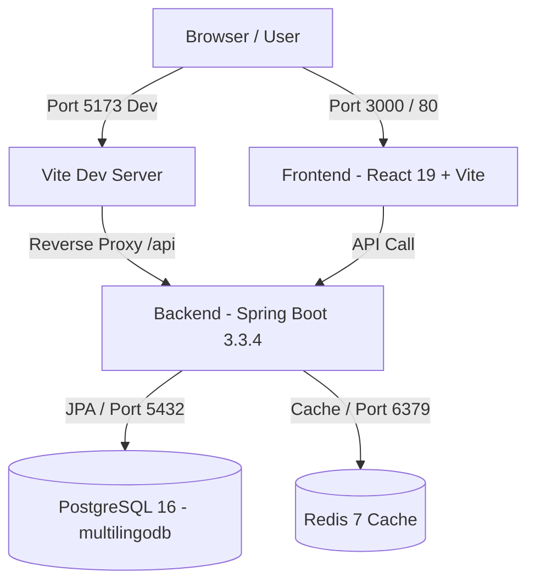
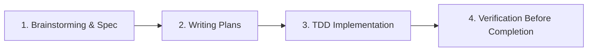

# 📘 HƯỚNG DẪN PHÁT TRIỂN & QUY CHUẨN LÀM VIỆC CHO TEAM (TEAM DEVELOPMENT GUIDE)
*Dự án: Nền tảng Thi thử và Đánh giá năng lực Đa ngôn ngữ (Multilingo Platform)*  
*Tài liệu tham chiếu chuẩn hóa theo quy tắc cốt lõi tại: [`GEMINI.md`](../GEMINI.md)*

---

## MỤC LỤC
1. [Tổng Quan Kiến Trúc & Công Nghệ](#1-tổng-quan-kiến-trúc--công-nghệ)
2. [Yêu Cầu Môi Trường (Prerequisites)](#2-yêu-cầu-môi-trường-prerequisites)
3. [Hướng Dẫn Khởi Chạy Dự Án (Getting Started)](#3-hướng-dẫn-khởi-chạy-dự-án-getting-started)
   - [Cách 1: Khởi chạy 1-Click bằng Docker Compose (Khuyên dùng)](#cách-1-khởi-chạy-1-click-bằng-docker-compose-khuyên-dùng)
   - [Cách 2: Khởi chạy môi trường Local Development](#cách-2-khởi-chạy-môi-trường-local-development)
4. [Thông Tin Cổng Kết Nối & Truy Cập Dịch Vụ](#4-thông-tin-cổng-kết-nối--truy-cập-dịch-vụ)
5. [Quy Chuẩn Kiến Trúc Base Backend (Bắt Buộc)](#5-quy-chuẩn-kiến-trúc-base-backend-bắt-buộc)
   - [5.1. Định Danh Entity & Tự Động Auditing](#51-định-danh-entity--tự-động-auditing)
   - [5.2. Định Dạng Chuẩn API Response](#52-định-dạng-chuẩn-api-response)
   - [5.3. Cơ Chế Bắt & Ném Lỗi Nghiệp Vụ](#53-cơ-chế-bắt--ném-lỗi-nghiệp-vụ)
6. [Quy Chuẩn Kiến Trúc Frontend](#6-quy-chuẩn-kiến-trúc-frontend)
7. [Quy Trình Phát Triển Tính Năng Mới (Superpowers Workflow)](#7-quy-trình-phát-triển-tính-năng-mới-superpowers-workflow)
8. [Quy Chuẩn Git & Quy Trình Tạo Pull Request (PR)](#8-quy-chuẩn-git--quy-trình-tạo-pull-request-pr)

---

## 1. TỔNG QUAN KIẾN TRÚC & CÔNG NGHỆ

Hệ thống Multilingo Platform được tổ chức theo mô hình phân tách độc lập Frontend – Backend – Database – Cache, sẵn sàng container hóa:



* **Backend:** Java 21, Spring Boot 3.3.4, Spring Data JPA, Spring Security, Hibernate 6, Lombok, JUnit 5, H2 (test profile).
* **Frontend:** React 19, TypeScript, Vite 8, TailwindCSS v4, Redux Toolkit, React Router DOM v7, Axios, Oxlint.
* **Database & Cache:** PostgreSQL 16 Alpine, Redis 7 Alpine.
* **Orchestration & Web Server:** Docker Compose v2, Nginx Alpine.

---

## 2. YÊU CẦU MÔI TRƯỜNG (PREREQUISITES)

Trước khi bắt đầu, các thành viên cần cài đặt sẵn trên máy:
* **[Git](https://git-scm.com/)** (v2.40+)
* **[Docker Desktop](https://www.docker.com/products/docker-desktop/)** (v24+ / Compose v2)
* **[Java JDK 21](https://adoptium.net/)** (Eclipse Temurin hoặc OpenJDK 21)
* **[Node.js](https://nodejs.org/)** (v20+ LTS) và `npm` (v10+)
* **IDE Khuyên dùng:** IntelliJ IDEA (Backend) và VS Code / WebStorm (Frontend).

---

## 3. HƯỚNG DẪN KHỞI CHẠY DỰ ÁN (GETTING STARTED)

### Cách 1: Khởi chạy 1-Click bằng Docker Compose (Khuyên dùng)
Phù hợp khi cần kiểm thử toàn bộ hệ thống hoặc chạy môi trường giống Production:

```bash
# 1. Di chuyển vào thư mục gốc dự án
cd multilingo-platform

# 2. Khởi chạy toàn bộ 4 dịch vụ (Postgres, Redis, Backend, Frontend)
docker compose up -d --build
```

Để theo dõi log hoặc dừng hệ thống:
```bash
# Xem log toàn bộ hệ thống theo thời gian thực
docker compose logs -f

# Dừng tất cả các dịch vụ
docker compose down
```

---

### Cách 2: Khởi chạy môi trường Local Development
Phù hợp khi đang code tính năng hàng ngày (Hot-reload Frontend + Debug Backend).

#### Bước 3.1: Bật Database & Redis qua Docker
Chỉ cần chạy 2 dịch vụ hạ tầng nền tảng:
```bash
# Khởi chạy riêng postgres và redis
docker compose up -d postgres_db redis_cache
```

#### Bước 3.2: Khởi chạy Backend (Spring Boot)
Mở một terminal mới:
```bash
cd backend

# Chạy backend qua Maven Wrapper
./mvnw spring-boot:run
# (Trên Windows CMD nếu lỗi có thể gõ: mvnw.cmd spring-boot:run)
```
> **Kiểm tra:** Truy cập `http://localhost:8080/api/test/hello` — kết quả trả về JSON chuẩn `ApiResponse`.

#### Bước 3.3: Khởi chạy Frontend (Vite + React)
Mở một terminal khác:
```bash
cd frontend

# Cài đặt dependencies (lần đầu tiên)
npm install

# Khởi chạy dev server
npm run dev
```
> **Kiểm tra:** Truy cập `http://localhost:5173` — trình duyệt sẽ tự động kết nối Backend qua proxy `/api`.

---

## 4. THÔNG TIN CỔNG KẾT NỐI & TRUY CẬP DỊCH VỤ

| Dịch vụ | Môi trường Docker | Môi trường Local Dev | Tài khoản / Ghi chú |
| :--- | :--- | :--- | :--- |
| **Frontend Web** | `http://localhost:3000` | `http://localhost:5173` | React 19 UI |
| **Backend API** | `http://localhost:8080` | `http://localhost:8080` | Spring Boot REST API |
| **PostgreSQL** | `localhost:5434` | `localhost:5432` hoặc `5434` | DB: `multilingodb`<br>User: `postgres` / Pass: `postgres` |
| **Redis Cache** | `localhost:6379` | `localhost:6379` | Không mật khẩu |

> [!TIP]
> **Kết nối GUI Database (DBeaver / DataGrip / pgAdmin):**  
> Khi chạy qua `docker compose`, cổng PostgreSQL được map ra máy host là **`5434`** (để tránh xung đột nếu máy bạn đã có sẵn PostgreSQL cục bộ ở cổng `5432`). Hãy điền Port: `5434`, DB: `multilingodb`, User: `postgres`, Pass: `postgres`.

---

## 5. QUY CHUẨN KIẾN TRÚC BASE BACKEND (BẮT BUỘC)

Tuân thủ nghiêm ngặt quy tắc tại [GEMINI.md](file:///f:/Working/JavaBackend/multilingo-platform/GEMINI.md). Mọi thành viên **KHÔNG ĐƯỢC** tự ý phá vỡ các quy chuẩn dưới đây:

### 5.1. Định Danh Entity & Tự Động Auditing
* Mọi Entity trong CSDL **BẮT BUỘC** kế thừa từ `BaseEntity`:
  ```java
  package com.multilingo.backend.common.base;
  ```
* Khóa chính là **`Integer id`**, tự tăng `GenerationType.IDENTITY`.
* **Không được khai báo lại** các trường `id`, `createdAt`, `updatedAt` trong Entity con.

```java
// Ví dụ Entity chuẩn:
@Entity
@Table(name = "exams")
@Getter
@Setter
@NoArgsConstructor
@AllArgsConstructor
public class Exam extends BaseEntity {
    
    @Column(nullable = false)
    private String title;
    
    // id, createdAt, updatedAt đã có sẵn từ BaseEntity!
}
```

---

### 5.2. Định Dạng Chuẩn API Response
* Mọi Controller endpoint **BẮT BUỘC** trả về `ResponseEntity<ApiResponse<T>>`.
* Cấu trúc JSON thống nhất toàn hệ thống:
  ```json
  {
    "success": true,
    "code": 200,
    "message": "Thao tác thành công",
    "data": { ... },
    "timestamp": "2026-09-25T08:30:00Z"
  }
  ```
* Sử dụng các static factory methods có sẵn trong `ApiResponse`:

```java
// Ví dụ Controller chuẩn:
@RestController
@RequestMapping("/api/v1/exams")
@RequiredArgsConstructor
public class ExamController {

    private final ExamService examService;

    @GetMapping("/{id}")
    public ResponseEntity<ApiResponse<ExamResponseDto>> getExamById(@PathVariable Integer id) {
        ExamResponseDto data = examService.getExamById(id);
        return ResponseEntity.ok(ApiResponse.success(data));
    }

    @PostMapping
    public ResponseEntity<ApiResponse<ExamResponseDto>> createExam(@Valid @RequestBody CreateExamRequest request) {
        ExamResponseDto data = examService.createExam(request);
        return ResponseEntity.status(HttpStatus.CREATED)
                             .body(ApiResponse.success("Tạo đề thi thành công", data));
    }
}
```

---

### 5.3. Cơ Chế Bắt & Ném Lỗi Nghiệp Vụ
* **Tuyệt đối không** trả về response lỗi thủ công qua Map hoặc chuỗi tùy tiện.
* Khi có lỗi nghiệp vụ (không tìm thấy dữ liệu, không có quyền, trùng lặp...), hãy ném `AppException` kết hợp enum `ErrorCode`:

```java
// ĐÚNG - Ném AppException với ErrorCode định nghĩa sẵn:
if (!examRepository.existsById(id)) {
    throw new AppException(ErrorCode.RESOURCE_NOT_FOUND, "Không tìm thấy đề thi có mã: " + id);
}

// Bổ sung ErrorCode mới vào com.multilingo.backend.common.exception.ErrorCode nếu cần:
EXAM_ALREADY_SUBMITTED(1005, HttpStatus.BAD_REQUEST, "Đề thi đã được nộp trước đó")
```

Hệ thống `GlobalExceptionHandler` sẽ tự động bắt `AppException`, `MethodArgumentNotValidException` (lỗi validation) và trả về HTTP Status cùng JSON `ApiResponse` lỗi đồng bộ.

---

## 6. QUY CHUẨN KIẾN TRÚC FRONTEND

* **Gọi API:** Sử dụng `axiosClient` tại `frontend/src/api/axiosClient.ts`.
  * `axiosClient` đã được cấu hình tự động unwrap `response.data`.
  * Tự động đính kèm token xác thực: `Authorization: Bearer <token>`.
* **Định nghĩa kiểu Type-Safe:**
  ```typescript
  // Khai báo Interface đồng bộ với ApiResponse từ Backend
  export interface ApiResponse<T> {
    success: boolean;
    code: number;
    message: string;
    data: T;
    timestamp: string;
  }
  ```
* **Routing:** Sử dụng React Router v7 (`BrowserRouter`). Khi thêm route mới, cần kiểm tra đảm bảo trang hoạt động tốt cả khi nhấn F5 trên Nginx Docker.
* **Kiểm tra chất lượng code trước khi đẩy:**
  ```bash
  cd frontend
  npm run lint   # Chạy oxlint kiểm tra syntax & logic
  npm run build  # Kiểm tra biên dịch TypeScript
  ```

---

## 7. QUY TRÌNH PHÁT TRIỂN TÍNH NĂNG MỚI (SUPERPOWERS WORKFLOW)

Khi nhận một nhiệm vụ/tính năng mới, toàn bộ thành viên (kể cả AI và lập trình viên) tuân thủ 4 bước bắt buộc:



> [!IMPORTANT]
> **Tính năng CHƯA CÓ đặc tả:** Nếu Use Case chưa có file tại `docs/DacTa/`, **BẮT BUỘC** viết Spec tại `docs/superpowers/specs/<tên-tính-năng>.md` trước khi lập kế hoạch và code. Không bỏ qua bước này.

1. **Bước 0 (Viết Spec - Nếu chưa có):**
   * Brainstorming phân tích nghiệp vụ: Input, Output, Business Rules, Edge Cases.
   * Viết Spec tại `docs/superpowers/specs/<tên-tính-năng>.md`.
   * Trình bày Spec cho team/user duyệt trước khi chuyển sang bước tiếp.
2. **Bước 1 (Đối soát nghiệp vụ):**
   * Đọc kỹ tài liệu đặc tả chức năng tại `docs/DacTa/` (ví dụ: `AD_UC01_...`, `AD_UC11_...`).
   * Xác định rõ Input, Output, Use Case và các điều kiện biên.
3. **Bước 2 (Lập kế hoạch chia nhỏ):**
   * Tạo Implementation Plan tại `docs/superpowers/plans/YYYY-MM-DD-<tên-tính-năng>.md`.
   * Chia nhỏ thành từng task độc lập (thời lượng 2 - 5 phút/task).
4. **Bước 3 (Triển khai TDD):**
   * **Red:** Viết bài Unit Test / Controller Test kiểm thử hành vi mong muốn trước → Chạy test thấy Fail.
   * **Green:** Viết mã tối thiểu trong Service/Controller để bài test Pass.
   * **Refactor:** Tối ưu mã nguồn, làm sạch code và chuẩn hóa định dạng.
5. **Bước 4 (Nghiệm thu bắt buộc trước khi bàn giao):**
   * Bắt buộc chạy lệnh:
     ```bash
     cd backend && ./mvnw clean test
     ```
   * **Tiêu chuẩn:** `Tests run: X, Failures: 0, Errors: 0, Skipped: 0` → **BUILD SUCCESS 100%**.
   * Frontend chạy: `npm run lint && npm run build` đạt **PASS 100%**.

---

## 8. QUY CHUẨN GIT & QUY TRÌNH TẠO PULL REQUEST (PR)

### 8.1. Quy ước đặt tên nhánh (Branching Convention)
* Nhánh chính:
  * `main`: Nhánh production, luôn ở trạng thái sẵn sàng deploy.
  * `develop`: Nhánh tích hợp chính của cả team.
* Nhánh làm việc cá nhân (tách từ `develop`):
  * Tính năng mới: `feature/UC<Mã_UC>-<tên-ngắn-gọn>` (ví dụ: `feature/UC11-dictionary-lookup`)
  * Sửa lỗi: `fix/<mô-tả-lỗi>` (ví dụ: `fix/cors-origin-issue`)
  * Refactor: `refactor/<nội-dung>`

### 8.2. Quy ước Commit Message (Conventional Commits)
* `feat:` Tính năng mới (ví dụ: `feat: implement dictionary search api`)
* `fix:` Sửa lỗi (ví dụ: `fix: handle null pointer in exam submission`)
* `test:` Thêm hoặc sửa test cases (ví dụ: `test: add unit test for BaseEntity auditing`)
* `refactor:` Tối ưu mã không thay đổi chức năng (ví dụ: `refactor: extract GlobalExceptionHandler`)
* `docs:` Thay đổi tài liệu (ví dụ: `docs: update team development guide`)

### 8.3. Quy trình Rebase & Đồng bộ Nhánh

**BẮT BUỘC** dùng `rebase` (thay vì `merge`) để giữ lịch sử Git sạch, tuyến tính:

```bash
# 1. Cập nhật nhánh develop mới nhất
git checkout develop
git pull origin develop

# 2. Quay lại nhánh feature và rebase
git checkout feature/UC11-dictionary-lookup
git rebase develop

# 3. Xử lý conflict (nếu có)
#    Mở file conflict → sửa thủ công → rồi:
git add <file-đã-resolve>
git rebase --continue
#    Nếu muốn huỷ rebase:
git rebase --abort

# 4. Push lên remote (BẮT BUỘC dùng --force-with-lease sau rebase)
git push --force-with-lease origin feature/UC11-dictionary-lookup
```

> [!CAUTION]
> **Quy tắc Force Push:**
> * **CHỈ ĐƯỢC** dùng `git push --force-with-lease` (KHÔNG BAO GIỜ dùng `--force` thuần).
> * **CHỈ ĐƯỢC** force push trên nhánh feature/fix **CÁ NHÂN** của bạn.
> * **TUYỆT ĐỐI KHÔNG** force push lên `main` hoặc `develop`.
> * **Thông báo team** trước khi force push nếu nhánh feature có nhiều người cùng làm.

### 8.4. Tiêu chí kiểm duyệt Pull Request (Definition of Done)
Một PR chỉ được merge vào `develop` khi đáp ứng đủ checklist:
- [ ] Code tuân thủ tiêu chuẩn Base (`BaseEntity`, `ApiResponse<T>`, `AppException`).
- [ ] `./mvnw clean test` chạy thành công 100% trên môi trường H2 in-memory.
- [ ] `npm run lint` và `npm run build` không có lỗi hoặc cảnh báo.
- [ ] Không commit mật khẩu, khóa bí mật hoặc file tạm (`.idea`, `target/`, `node_modules/`).
- [ ] Nhánh đã rebase lên `develop` mới nhất (không có merge commit rác).
- [ ] Đã có ít nhất 1 thành viên review và phê duyệt (Approved).

---

## 9. HƯỚNG DẪN SỬ DỤNG AI AGENT

Tham khảo tài liệu hướng dẫn chi tiết cách prompt, kịch bản mẫu và quy trình phối hợp với AI Agent tại:

👉 **[`docs/AI_AGENT_GUIDE.md`](AI_AGENT_GUIDE.md)** — Hướng dẫn sử dụng AI Agent cho Team Multilingo.

