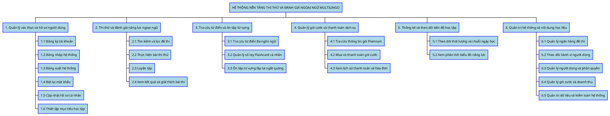

# HƯỚNG DẪN VẼ BIỂU ĐỒ PHÂN RÃ CHỨC NĂNG (FDD / WBS)
*Dự án: Hệ thống Nền tảng Thi thử và Đánh giá Ngoại ngữ Multilingo*

Dựa vào các biểu đồ bạn cung cấp, hệ thống được cấu trúc một cách logic và phân rã thành **6 phân hệ lớn** tách biệt. 

---

## 1. Cấu trúc Phân rã Chức năng
Hệ thống **Multilingo** sẽ bao gồm:
1. **Quản lý xác thực và hồ sơ người dùng**
2. **Thi thử và đánh giá năng lực ngoại ngữ**
3. **Tra cứu từ điển và ôn tập từ vựng**
4. **Quản lý gói cước và thanh toán dịch vụ**
5. **Thống kê và theo dõi tiến độ học tập**
6. **Quản trị hệ thống và nội dung học liệu**

---

## 2. Code PlantUML vẽ tự động (Dạng Cây / WBS)
Để đưa lên báo cáo nhanh nhất, bạn hãy copy đoạn code dưới đây và dán vào [PlantUML Web Server](http://www.plantuml.com/plantuml/uml/). 

---

## 3. Trình bày chi tiết phân cấp (Phù hợp copy vào báo cáo Word)
Bên cạnh hình ảnh, bạn có thể copy dàn ý dưới đây vào file Word để viết báo cáo đặc tả chi tiết:

- **HỆ THỐNG NỀN TẢNG THI THỬ VÀ ĐÁNH GIÁ NGOẠI NGỮ MULTILINGO**
  - **1. Quản lý xác thực và hồ sơ người dùng**
    - 1.1 Đăng ký tài khoản
    - 1.2 Đăng nhập hệ thống
    - 1.3 Đăng xuất hệ thống
    - 1.4 Đặt lại mật khẩu
    - 1.5 Cập nhật hồ sơ cá nhân
    - 1.6 Thiết lập mục tiêu học tập
  - **2. Thi thử và đánh giá năng lực ngoại ngữ**
    - 2.1 Tìm kiếm và lọc đề thi
    - 2.2 Thực hiện bài thi thử
    - 2.3 Luyện tập
    - 2.4 Xem kết quả và giải thích bài thi
  - **3. Tra cứu từ điển và ôn tập từ vựng**
    - 3.1 Tra cứu từ điển đa ngôn ngữ
    - 3.2 Quản lý sổ tay Flashcard cá nhân
    - 3.3 Ôn tập từ vựng lặp lại ngắt quãng
  - **4. Quản lý gói cước và thanh toán dịch vụ**
    - 4.1 Tra cứu thông tin gói Premium
    - 4.2 Mua và thanh toán gói cước
    - 4.3 Xem lịch sử thanh toán và hóa đơn
  - **5. Thống kê và theo dõi tiến độ học tập**
    - 5.1 Theo dõi thời lượng và chuỗi ngày học
    - 5.2 Xem phân tích biểu đồ năng lực
  - **6. Quản trị hệ thống và nội dung học liệu**
    - 6.1 Quản lý ngân hàng đề thi
    - 6.2 Theo dõi hành vi người dùng
    - 6.3 Quản lý người dùng và phân quyền 
    - 6.4 Quản lý gói cước và doanh thu
    - 6.5 Quản trị dữ liệu và kiểm toán hệ thống *(Gộp Audit Logs, Dashboard thống kê hệ thống, Giám sát gian lận)*
