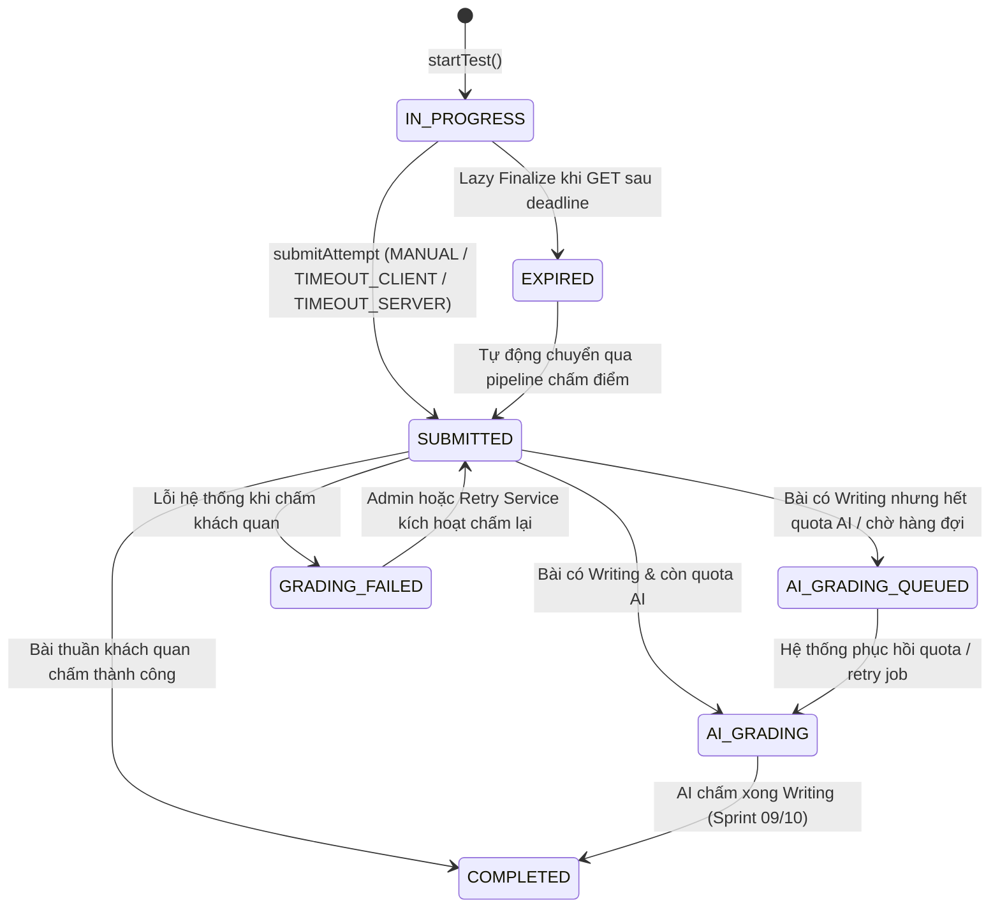
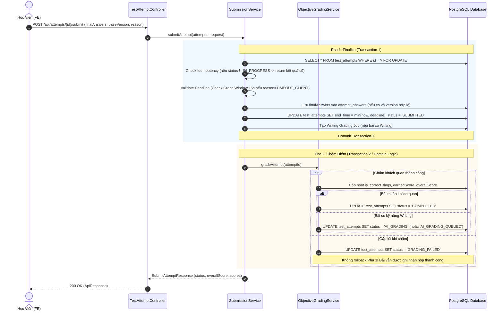

# Sprint 05 — Timer và Nộp Bài: Design Spec

**Ngày soạn:** 2026-10-02  
**Sprint:** 05 — Timer và Nộp Bài (Submission Pipeline & Expiration Architecture)  
**Use Case:** `UC08.5` (Tự động thu bài khi hết giờ), `UC08` (Nộp bài thi thử / luyện tập), `UC09` (Kích hoạt chấm điểm)  
**Phụ thuộc:** Sprint 03 (Autosave & Persistence), Sprint 04 (Objective Grading Engine)  
**Nhánh Git:** `feature/UC09-sprint05`  

---

## 1. Mục Tiêu & Vấn Đề Cần Giải Quyết

### 1.1 Hiện Trạng Kỹ Thuật
- `TestAttemptServiceImpl.submitAttempt()` hiện tại gộp việc lưu đáp án cuối, đổi trạng thái và chấm điểm vào một khối xử lý duy nhất. Nếu quá trình chấm gặp lỗi, toàn bộ transaction bị ảnh hưởng.
- Chưa có cơ chế bảo vệ bài thi khi hết giờ: Client tính giờ độc lập bằng cách trừ dần `t = t - 1`, dẫn đến hiện tượng trôi thời gian (timer drift) khi tab trình duyệt bị ẩn (background throttling).
- Thiếu cơ chế xử lý bài quá hạn phía server: Nếu học viên tắt trình duyệt trước khi hết giờ hoặc mất mạng, bài thi bị kẹt vĩnh viễn ở trạng thái `IN_PROGRESS`. Nếu học viên reload trang sau deadline nhưng trước khi cron chạy, học viên vẫn có thể mở lại workspace và tiếp tục làm bài.
- Autosave ngầm không kiểm tra deadline độc lập, dẫn đến nguy cơ ghi đè đáp án sau khi hết giờ.

### 1.2 Mục Tiêu Sprint 05
1. **Tách biệt 2 pha Nộp bài (Two-phase Submission Pipeline):**
   - **Phase 1 (Finalize/Đóng bài):** Khóa bài, cố định `end_time = min(now, deadline)`, chốt đáp án, chuyển trạng thái `SUBMITTED`.
   - **Phase 2 (Grading/Chấm điểm):** Chấm khách quan độc lập. Lỗi chấm chuyển `GRADING_FAILED`, không làm mất bài đã đóng.
2. **Cơ chế Thu bài 3 lớp bảo vệ (3-Tier Auto-Submit & Expiration):**
   - **Lớp 1 (Client Timeout):** Client countdown chạm 0 $\rightarrow$ khóa form $\rightarrow$ gửi submit với `reason = TIMEOUT_CLIENT` trong **Grace Window 15 giây**.
   - **Lớp 2 (Lazy Finalize):** Mọi request `GET /attempts/{id}` và `GET /attempts/{id}/result` kiểm tra `now > deadline`; nếu đúng, lập tức đóng bài phía server và trả trạng thái `EXPIRED` hoặc `SUBMITTED`.
   - **Lớp 3 (Server Background Scheduler):** Cron job `@Scheduled` định kỳ quét các attempt `IN_PROGRESS` có `now > deadline + 15s`, dùng `SELECT ... FOR UPDATE SKIP LOCKED` để chốt bài với `reason = TIMEOUT_SERVER`.
3. **Đồng bộ thời gian chuẩn xác & Chống Timer Drift:**
   - Server trả `serverTime` (UTC ISO-8601) kèm `deadline`.
   - Client tính `offset = serverTime - Date.now()` một lần, tính thời gian còn lại ở mỗi tick từ `deadline`, tự động đồng bộ lại khi có sự kiện `visibilitychange`.
4. **Xử lý Grace Window & Autosave Conflict:**
   - Grace Window 15s **chỉ áp dụng cho request submit do timeout** (`reason = TIMEOUT_CLIENT`).
   - Endpoint Autosave kiểm tra deadline nghiêm ngặt (`now <= deadline`). Autosave sau deadline hoặc sau khi bài đã chốt trả HTTP 409 kèm mã lỗi `ATTEMPT_EXPIRED` hoặc `ATTEMPT_ALREADY_SUBMITTED` để frontend hủy timer.
5. **Xử lý Quota AI an toàn:**
   - Tạo job Writing trong cùng transaction với đóng bài. Nếu hết hạn mức AI, vẫn đóng bài và chấm điểm khách quan bình thường; phần Writing chuyển sang `AI_GRADING_QUEUED` cho phép retry sau, không từ chối nộp bài.

---

## 2. Kiến Trúc Chi Tiết

### 2.1 State Machine Mở Rộng của `TestAttempt`



### 2.2 Quy Trình Nộp Bài 2 Pha (Two-phase Submission Pipeline)



---

## 3. Data Contracts & Schema Updates

### 3.1 Enums Mới & Mở Rộng

#### `SubmitReason.java`
```java
package com.multilingo.backend.modules.testing.model.enums;

public enum SubmitReason {
    MANUAL,          // Học viên chủ động bấm nút "Nộp bài"
    TIMEOUT_CLIENT,  // Client countdown về 00:00 và tự động gửi submit
    TIMEOUT_SERVER   // Server thu bài (Lazy Finalize hoặc Cron Scheduler)
}
```

#### Cập nhật `AttemptStatus.java`
```java
package com.multilingo.backend.modules.testing.model.enums;

public enum AttemptStatus {
    IN_PROGRESS,
    SUBMITTED,          // Đã chốt bài thành công, đang trong tiến trình chấm điểm
    GRADING_FAILED,     // Lỗi trong quá trình chấm điểm khách quan
    AI_GRADING,         // Đang đợi Gemini AI chấm Writing
    AI_GRADING_QUEUED,  // Hết quota AI hoặc hàng đợi quá tải, chờ retry
    COMPLETED,          // Đã hoàn tất toàn bộ quá trình thi và chấm điểm
    EXPIRED             // Hết hạn và được server thu hồi tự động
}
```

### 3.2 Request / Response DTOs

#### `SubmitAttemptRequest.java`
```java
package com.multilingo.backend.modules.testing.dto.request;

import com.multilingo.backend.modules.testing.model.enums.SubmitReason;
import jakarta.validation.constraints.NotNull;
import lombok.AllArgsConstructor;
import lombok.Builder;
import lombok.Data;
import lombok.NoArgsConstructor;

import java.util.List;

@Data
@Builder
@NoArgsConstructor
@AllArgsConstructor
public class SubmitAttemptRequest {
    @NotNull(message = "Lý do nộp bài không được để trống")
    private SubmitReason reason;

    private Integer baseVersion;

    // Danh sách câu trả lời cuối cùng (tùy chọn; nếu null sẽ dùng đáp án đã autosave gần nhất)
    private List<PartAnswerSubmission> finalAnswers;

    @Data
    @Builder
    @NoArgsConstructor
    @AllArgsConstructor
    public static class PartAnswerSubmission {
        private Integer partId;
        private Object answers; // Map<String, Object> questionId -> answer
    }
}
```

#### Bổ sung trong `AttemptWorkspaceResponse.java` & `AttemptResponse.java`
```java
// Bổ sung các trường thời gian chuẩn UTC ISO-8601
private Instant serverTime; // Luôn trả thời điểm hiện tại của server (UTC)
private Instant deadline;   // Thời điểm hết giờ làm bài (UTC), null nếu là PRACTICE
private Integer gracePeriodSeconds; // 15 giây
```

---

## 4. Các Thành Phần Xử Lý Nghiệp Vụ Chính

### 4.1 Quản Lý Thời Gian & Deadline Validation (`SubmissionServiceImpl`)
1. **Quy tắc tính `end_time`:**
   $$\text{endTime} = \min(\text{now}, \text{deadline})$$
   Đảm bảo `end_time` lưu trong database **không bao giờ vượt quá `deadline`**, kể cả khi request submit đến muộn do mạng chậm.
2. **Quy tắc Grace Window (15 giây):**
   - Nếu `reason == MANUAL`: Bắt buộc $\text{now} \le \text{deadline}$. Nếu $\text{now} > \text{deadline}$, từ chối với lỗi `ATTEMPT_EXPIRED (HTTP 409)`.
   - Nếu `reason == TIMEOUT_CLIENT`: Cho phép nếu $\text{now} \le \text{deadline} + 15\text{s}$. Payload đáp án cuối cùng được chấp nhận ghi nhận.
   - Nếu $\text{now} > \text{deadline} + 15\text{s}$: Không nhận `finalAnswers` mới; tự động đóng bài dựa trên đáp án đã autosave gần nhất (`reason = TIMEOUT_SERVER`).

### 4.2 Cơ Chế Lazy Finalize
Được tích hợp vào:
- `TestAttemptService.getAttemptWorkspace(attemptId)`
- `TestAttemptService.getAttemptResult(attemptId)`

**Luồng thực thi:**
1. Lấy `TestAttempt` theo `attemptId`.
2. Kiểm tra điều kiện:
   ```java
   if (attempt.getMode() == TestMode.MOCK_TEST 
       && attempt.getStatus() == AttemptStatus.IN_PROGRESS 
       && attempt.getDeadline() != null 
       && Instant.now().isAfter(attempt.getDeadline())) {
       
       // Kích hoạt đóng bài tức thì
       finalizeExpiredAttempt(attempt, SubmitReason.TIMEOUT_SERVER);
   }
   ```
3. Chặn hoàn toàn việc học viên tải lại trang để gõ tiếp sau khi đã hết giờ.

### 4.3 Background Scheduler Quét Attempt Quá Hạn (`AttemptExpirationScheduler`)
- Cấu hình `@Scheduled(fixedDelay = 30000)` (mỗi 30 giây chạy một lần).
- Tìm kiếm các attempt cần thu bài:
  ```sql
  SELECT a FROM TestAttempt a 
  WHERE a.status = 'IN_PROGRESS' 
    AND a.deadline IS NOT NULL 
    AND a.deadline < :expiredThreshold
  ORDER BY a.deadline ASC
  ```
  *(với `expiredThreshold = Instant.now().minusSeconds(15)`)*
- Sử dụng query khóa dòng: `PESSIMISTIC_WRITE` kết hợp `SKIP LOCKED` (nếu hỗ trợ bởi dialect) hoặc xử lý theo batch giới hạn (50 record / lần) để không gây nghẽn database.
- Đánh chỉ mục (index) cho bảng `test_attempts`: `CREATE INDEX idx_attempts_status_deadline ON test_attempts(status, deadline);`

### 4.4 Phân Xử Autosave & Submit (`autosaveAnswers`)
- Trong `TestAttemptServiceImpl.autosaveAnswers()`:
  ```java
  if (attempt.getStatus() != AttemptStatus.IN_PROGRESS) {
      throw new AppException(ErrorCode.ATTEMPT_ALREADY_SUBMITTED); // 409 Conflict
  }
  if (attempt.getMode() == TestMode.MOCK_TEST && attempt.getDeadline() != null && Instant.now().isAfter(attempt.getDeadline())) {
      throw new AppException(ErrorCode.ATTEMPT_EXPIRED); // 409 Conflict
  }
  ```
- Phía Frontend, khi nhận mã HTTP 409 (`ATTEMPT_ALREADY_SUBMITTED` hoặc `ATTEMPT_EXPIRED`), lập tức clear interval autosave, không thử lưu lại.

---

## 5. Thiết Kế Frontend & Trải Nghiệm Người Dùng (UX)

### 5.1 Thuật Toán Countdown Không Drift
```typescript
// Khởi tạo một lần khi nhận DTO từ Backend
const serverTimeMs = new Date(attempt.serverTime).getTime();
const clientNowMs = Date.now();
const timeOffset = serverTimeMs - clientNowMs; // Độ lệch giữa server và client

const deadlineMs = new Date(attempt.deadline).getTime();

// Trong hàm tick (chạy mỗi 1000ms):
const currentEstimatedServerTime = Date.now() + timeOffset;
const remainingSeconds = Math.max(0, Math.floor((deadlineMs - currentEstimatedServerTime) / 1000));

// Tự động đồng bộ lại khi chuyển tab
document.addEventListener("visibilitychange", () => {
  if (document.visibilityState === "visible") {
    // Re-calculate remaining seconds ngay lập tức
    calculateRemaining();
  }
});
```

### 5.2 Auto-submit UX & Modal Hết Giờ
1. **Khi `remainingSeconds === 0`:**
   - Khóa toàn bộ input (vô hiệu hóa các nút radio, checkbox, textarea).
   - Hiển thị Overlay toàn màn hình (Modal không cho đóng):
     - Biểu tượng đồng hồ cát / spinner xoay.
     - Tiêu đề: **"Thời gian làm bài đã hết!"**
     - Mô tả: *"Hệ thống đang tự động thu bài và tổng kết kết quả thi của bạn. Vui lòng không đóng trình duyệt..."*
   - Tự động gọi API: `POST /api/attempts/{id}/submit` với `reason = TIMEOUT_CLIENT`.
2. **Xử lý sự cố mạng khi Auto-submit:**
   - Nếu request timeout hoặc mất mạng:
     - Overlay chuyển sang cảnh báo màu vàng: *"Kết nối mạng không ổn định. Đang tự động thử lại sau 3s... (Lần 1/5)"*.
     - Kèm nút bấm chủ động: **"Thử nộp lại ngay"**.
     - Nếu nhận lỗi 409 (`ATTEMPT_ALREADY_SUBMITTED` hoặc `ATTEMPT_EXPIRED`): Xem như thành công vì server đã chốt bài, tự động điều hướng sang `/exam/result/{id}`.

### 5.3 Flush Dữ Liệu Trước Khi Hết Giờ
- Khi đồng hồ còn dưới 30 giây: Tự động kích hoạt lưu nháp một lần nếu có thay đổi (`dirty = true`).
- Lắng nghe sự kiện `visibilitychange` hoặc `pagehide` để gửi `navigator.sendBeacon` lưu đáp án khẩn cấp.

---

## 6. Kế Hoạch Triển Khai (Sprint 05 Tasks)

| Task ID | Tên Task | Mô Tả & Tiêu Chí Nghiệm Thu |
|---|---|---|
| **S05-01** | Submit Service (Finalize Phase) | Nhận `finalAnswers`, `baseVersion`, `reason`, đổi status `SUBMITTED`, lưu version. Chấm điểm tách riêng. |
| **S05-02** | Tách Đóng bài & Chấm điểm | Tách 2 pha riêng biệt. Lỗi chấm điểm gán `GRADING_FAILED`, không rollback việc đóng bài. |
| **S05-03** | Concurrency & Idempotency | Dùng `SELECT ... FOR UPDATE`, xử lý idempotency, 2 request đồng thời chỉ chốt 1 lần. |
| **S05-04** | Cố định `end_time` | Gán `end_time = min(now, deadline)`, bảo đảm không bao giờ vượt deadline. |
| **S05-05** | Job Writing & Quota Handling | Khởi tạo Writing job cùng transaction đóng bài; nếu hết quota chuyển `AI_GRADING_QUEUED`. |
| **S05-06** | Grace Window 15s | Áp dụng 15s cho `reason = TIMEOUT_CLIENT`; từ chối autosave sau deadline. |
| **S05-07** | Lazy Finalize | `GET /attempts/{id}` và `/result` tự chốt bài nếu `now > deadline`, trả `EXPIRED`/`SUBMITTED`. |
| **S05-08** | Frontend Countdown Timer | Tính offset một lần, tick từ deadline, tính lại khi `visibilitychange`, chống drift. |
| **S05-09** | Modal Xác Nhận Nộp Bài | Thống kê số câu bỏ trống, cảnh báo câu chưa làm, chống double-click. |
| **S05-10** | Auto-submit & Error UX | Khóa form khi hết giờ, overlay "Đang nộp bài...", retry có backoff, nút nộp lại, điều hướng 409. |
| **S05-11** | Phân Xử Autosave & Submit | Autosave kiểm tra deadline độc lập; trả 409 khi bài đã nộp/hết hạn để FE dừng autosave. |
| **S05-12** | Background Expiration Scheduler | `@Scheduled` quét `IN_PROGRESS` có `deadline + 15s < now`, dùng `SKIP LOCKED`, batch index. |
| **S05-13** | Backend Concurrency Tests | Test 2 submit song song, nộp tay vs timeout server, autosave muộn sau submit, nộp trong/sau grace window. |
| **S05-14** | Frontend Fake Timers Tests | Test countdown với fake timers, bù offset, `visibilitychange`, tự khóa form và retry overlay. |
| **S05-15** | E2E & Resilience Tests | Test mất mạng lúc hết giờ, reload sau deadline (lazy finalize), Practice không có timer. |
